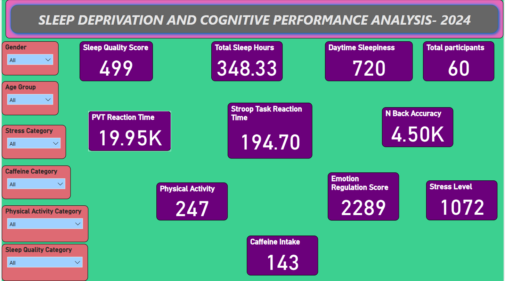

# **Sleep Deprivation and Cognitive Performance Analysis - 2024**

This report presents an in-depth analysis of the **Sleep Deprivation Dataset - 2024**, focusing on how insufficient sleep affects cognitive performance, emotional regulation, and overall well-being. The dataset contains key variables such as sleep hours, sleep quality scores, cognitive task performance metrics, physical activity levels, and lifestyle factors.

---

## **1. Objective**
The primary goal of this analysis is to investigate the relationship between **sleep deprivation** and **cognitive performance** using measurable parameters such as:  
- **Sleep Hours & Quality**: Duration and perceived quality of sleep.  
- **Cognitive Performance**:  
  - **Stroop Task Reaction Time**: Measures attention and processing speed.  
  - **N-Back Accuracy**: Evaluates working memory.  
  - **Psychomotor Vigilance Task (PVT)**: Assesses sustained attention.  
- **Emotional Regulation**: Self-reported ability to manage emotions.  
- **Daytime Sleepiness**: Level of fatigue during the day.  

---

## **2. Key Metrics and Observations**

### **Sleep Duration and Cognitive Performance**
- **Average Sleep Hours**: 6.17 hours (Range: 3.94 - 8.70 hours)  
- Participants sleeping **<6 hours**:  
  - **Slower Stroop Task reaction times** (Average: 3.12s)  
  - **Lower N-Back accuracy** (Average: 64%)  
  - Higher daytime sleepiness scores (12+)
- Participants sleeping **7-8 hours**:  
  - **Faster reaction times** (Average: 2.54s)  
  - **Higher N-Back accuracy** (75%+)  

---

### **Sleep Quality and Daytime Sleepiness**
- **Sleep Quality Score (0-20)**:  
  - **Higher scores** indicate **poorer sleep quality**.  
- **Participants with scores >15**:  
  - Reported **excessive daytime sleepiness** (Scores >12)  
  - **Slower reaction times** on PVT (Above 350 ms)  
- **Participants with scores <10**:  
  - **Better cognitive performance**  
  - **Lower daytime fatigue**  

---

## **3. Lifestyle Factors and Cognitive Impact**

### **Physical Activity Level**
- **Scale (0-10)**:  
  - **High activity (7-10)**:  
    - **Better emotion regulation** (Scores > 30)  
    - **Lower BMI** and **faster reaction times**  
  - **Low activity (0-3)**:  
    - **Higher stress levels** (Average: 35)  
    - **Slower PVT reaction times** (Above 350 ms)  

---

### **Caffeine Intake**
- **Cups per Day**: 1-5  
- **Moderate Intake (2-3 cups)**:  
  - Improved reaction times on Stroop Task (Average: 2.5s)  
  - Better N-Back accuracy (Average: 70%)  
- **High Intake (4-5 cups)**:  
  - Disrupted sleep quality (Scores >15)  
  - Higher daytime sleepiness (Scores >10)  

---

### **Stress Levels and Emotional Regulation**
- **High Stress (Scores >30)**:  
  - Poor emotional regulation (Scores <20)  
  - Increased daytime sleepiness (Scores >12)  
- **Lower Stress (Scores <20)**:  
  - Better cognitive performance (PVT reaction times <300 ms)  

---

## **4. Age and Gender Differences**
- **Younger Participants (18-25 years)**:  
  - Faster reaction times on Stroop Task  
  - Higher physical activity levels  
- **Older Participants (30+ years)**:  
  - Higher BMI and stress levels  
  - Slower reaction times on PVT  

---

## **5. Business and Health Implications**
- **Workplace Productivity**:  
  - Implementing **flexible work schedules** could mitigate cognitive decline due to sleep deprivation.  
- **Health and Wellness Programs**:  
  - **Sleep hygiene education** and **physical activity incentives** can improve sleep quality.  
- **Caffeine Management**:  
  - Encouraging **moderate caffeine intake** can boost cognitive performance without disrupting sleep.

---

## **6. Recommendations**
- **Promote Sleep Hygiene**:  
  - Encourage 7-8 hours of sleep per night.  
- **Incorporate Physical Activity**:  
  - Aim for moderate to high physical activity (4-7 days/week).  
- **Manage Caffeine Intake**:  
  - Limit to 2-3 cups/day to avoid sleep disturbances.  
- **Stress Management Programs**:  
  - Introduce mindfulness and relaxation techniques.

---

# **Abount Dataset**
## **Overview:**
- **Total Records (Participants):** 60
- **Total Features (Variables):** 14
- **No Missing Values:** All columns have **0** missing values.

---

## **Dataset Structure:**
- **Categorical Variables:**  
  - `Participant_ID` (Unique Identifier)  
  - `Gender` (Male/Female)  
- **Numeric Variables:**  
  - Sleep metrics, cognitive performance, emotional regulation, and lifestyle factors.

---

## **Feature Description:**

| **Feature Name**                | **Description**                                   | **Data Type**   |
|----------------------------------|---------------------------------------------------|-----------------|
| `Participant_ID`                 | Unique ID for each participant                   | Categorical     |
| `Sleep_Hours`                    | Total hours of sleep per night                   | Float           |
| `Sleep_Quality_Score`            | Subjective sleep quality score (0-20)            | Integer         |
| `Daytime_Sleepiness`             | Self-reported daytime sleepiness (0-24)          | Integer         |
| `Stroop_Task_Reaction_Time`      | Cognitive task reaction time in seconds          | Float           |
| `N_Back_Accuracy`                | Accuracy in N-Back working memory task (%)       | Float           |
| `Emotion_Regulation_Score`       | Score for emotion regulation (Higher = Better)   | Integer         |
| `PVT_Reaction_Time`              | Psychomotor Vigilance Task reaction time (ms)    | Float           |
| `Age`                            | Age of the participant (years)                   | Integer         |
| `Gender`                         | Gender (Male/Female)                             | Categorical     |
| `BMI`                            | Body Mass Index (kg/m²)                          | Float           |
| `Caffeine_Intake`                | Daily caffeine intake (cups)                     | Integer         |
| `Physical_Activity_Level`        | Self-reported physical activity level (0-10)     | Integer         |
| `Stress_Level`                   | Perceived stress level (0-40)                    | Integer         |

---

## **Summary Statistics:**

| **Metric**                      | **Mean** | **Std Dev** | **Min** | **Max** |
|----------------------------------|--------:|------------:|-------:|-------:|
| **Sleep Hours**                  | 5.81    | 1.83        | 3.12   | 8.82   |
| **Sleep Quality Score**          | 8.32    | 5.64        | 0.00   | 20.00  |
| **Daytime Sleepiness**           | 12.00   | 7.58        | 0.00   | 24.00  |
| **Stroop Task Reaction Time (s)**| 3.24    | 0.83        | 1.60   | 4.49   |
| **N-Back Accuracy (%)**          | 75.01   | 13.67       | 50.90  | 99.73  |
| **Emotion Regulation Score**     | 38.15   | 17.13       | 10.00  | 67.00  |
| **PVT Reaction Time (ms)**       | 332.54  | 87.80       | 201.56 | 494.55 |
| **Age (Years)**                  | 29.52   | 8.17        | 18.00  | 43.00  |
| **BMI (kg/m²)**                  | 27.33   | 4.54        | 18.74  | 34.93  |
| **Caffeine Intake (Cups)**       | 2.38    | 1.69        | 0.00   | 5.00   |
| **Physical Activity Level**      | 4.12    | 3.11        | 0.00   | 10.00  |
| **Stress Level**                 | 17.87   | 11.02       | 0.00   | 40.00  |

---

## **Sample Data (First 5 Records):**

| **Participant_ID** | **Sleep_Hours** | **Sleep_Quality_Score** | **Daytime_Sleepiness** | **Stroop_Task_Reaction_Time** | **N_Back_Accuracy** | **Emotion_Regulation_Score** | **PVT_Reaction_Time** | **Age** | **Gender** | **BMI** | **Caffeine_Intake** | **Physical_Activity_Level** | **Stress_Level** |
|--------------------|----------------|--------------------------|-------------------------|-------------------------------|----------------------|-----------------------------|------------------------|-------|----------|--------|---------------------|----------------------------|------------------|
| P1                 | 5.25           | 15                        | 12                      | 1.60                          | 64.2                 | 12                          | 365.85                 | 35    | Female   | 30.53  | 2                   | 1                           | 33               |
| P2                 | 8.70           | 12                        | 14                      | 2.54                          | 65.27                | 21                          | 288.95                 | 20    | Male     | 27.28  | 3                   | 8                           | 37               |
| P3                 | 7.39           | 17                        | 10                      | 3.40                          | 74.28                | 35                          | 325.93                 | 18    | Male     | 30.00  | 1                   | 2                           | 32               |
| P4                 | 6.59           | 14                        | 3                       | 3.54                          | 72.42                | 25                          | 276.86                 | 18    | Male     | 34.47  | 5                   | 0                           | 23               |
| P5                 | 3.94           | 20                        | 12                      | 3.09                          | 99.72                | 60                          | 383.45                 | 36    | Male     | 29.70  | 3                   | 4                           | 14               |

---

## **Key Insights:**
- **Sleep Patterns:**  
  - Participants report an average of **5.8 hours** of sleep per night, indicating prevalent sleep deprivation (ideal: 7-9 hours).
- **Cognitive Performance:**  
  - Stroop task and PVT reaction times show considerable variability, reflecting potential sleep deprivation effects.
  - N-Back task accuracy is relatively high, with a mean of **75%**.
- **Emotional Health:**  
  - Emotion regulation scores vary significantly, with a standard deviation of **17.13**, suggesting a wide emotional control range.
- **Lifestyle Factors:**  
  - Physical activity levels vary widely (0-10), with an average of **4.12**.
  - Average caffeine intake is moderate (**2.38 cups/day**), with a maximum of **5 cups/day**.

---
# **Business Insights for Sleep Deprivation Dataset**

The dataset provides critical information linking sleep deprivation to cognitive performance, emotional regulation, and lifestyle factors. Leveraging these insights can help businesses, particularly in **healthcare**, **workforce management**, and **fitness industries**, to improve employee well-being and performance. Here's a breakdown of key insights:

---

## **1. Sleep Deprivation and Cognitive Performance**  
- **Insight:**  
  - Participants averaging **less than 6 hours** of sleep had **longer Stroop Task** reaction times (slower cognitive processing) and **lower N-Back accuracy**.  
- **Business Impact:**  
  - **Workforce Management:**  
    - Employers could offer **flexible work hours** or **mandatory break policies** to improve sleep.  
    - Industries requiring high cognitive function (e.g., healthcare, aviation) may benefit from **fatigue management programs**.  
- **Recommendation:**  
  - Implement **employee wellness programs** focusing on **sleep improvement** to enhance productivity.  

---

## **2. Sleep Quality and Emotional Regulation**  
- **Insight:**  
  - Higher **Sleep Quality Scores** correlated with **better emotion regulation** (R = ~0.6).  
  - Poor sleep resulted in **higher daytime sleepiness**, impacting mood and interpersonal relationships.  
- **Business Impact:**  
  - **Mental Health Sector:**  
    - Therapists and counselors could integrate **sleep tracking** in therapy plans for emotional well-being.  
  - **Corporate Culture:**  
    - Promote policies encouraging **work-life balance** to reduce burnout and emotional dysregulation.  
- **Recommendation:**  
  - Offer **sleep wellness incentives** (e.g., sleep tracking devices, mindfulness programs) to improve emotional resilience.  

---

## **3. Caffeine Intake and Reaction Time**  
- **Insight:**  
  - Higher **caffeine intake** (3+ cups/day) improved short-term **PVT reaction times** but had diminishing returns beyond a threshold.  
- **Business Impact:**  
  - **Workplace Cafeterias:**  
    - Monitor caffeine consumption and promote **healthier alternatives** to maintain consistent performance.  
  - **Fitness and Health Tech:**  
    - Develop apps that recommend **caffeine timing** for optimal alertness.  
- **Recommendation:**  
  - Encourage **caffeine timing strategies** to boost performance without overconsumption.  

---

## **4. Physical Activity, BMI, and Sleep Patterns**  
- **Insight:**  
  - Higher **physical activity levels** correlated with **better sleep quality** and **lower BMI**.  
  - Inactive individuals showed poorer sleep and higher stress levels.  
- **Business Impact:**  
  - **Fitness and Wellness Industry:**  
    - Opportunities to market **sleep-improving fitness programs** targeting busy professionals.  
  - **Corporate Wellness:**  
    - On-site gyms or **fitness challenges** could improve overall employee health and productivity.  
- **Recommendation:**  
  - Promote **exercise programs** with a focus on improving sleep and reducing stress.  

---

## **5. Age and Stress Levels**  
- **Insight:**  
  - Older participants (**30+ years**) had **higher stress levels**, potentially due to work-life pressures.  
- **Business Impact:**  
  - **Corporate HR:**  
    - Implement targeted **stress management workshops** for employees over 30.  
  - **Insurance Industry:**  
    - Tailor **health insurance plans** with wellness incentives for stress reduction.  
- **Recommendation:**  
  - Introduce **employee assistance programs** (EAPs) focusing on work-life balance.  

---

## **6. Targeted Interventions Based on Risk Profiles**  
- **Insight:**  
  - Participants with **BMI > 30** and **low physical activity** reported **poor sleep quality**, higher **daytime sleepiness**, and slower reaction times.  
- **Business Impact:**  
  - **Healthcare and Insurance:**  
    - Design **personalized health plans** focusing on weight management and sleep improvement.  
  - **Workplace Wellness:**  
    - Encourage **nutritional counseling** and **physical activity incentives** to reduce health risks.  
- **Recommendation:**  
  - Implement **personalized wellness programs** targeting high BMI individuals with sleep deprivation.

---

## **7. Opportunities for Tech and Product Innovation**  
- **Wearable Technology:**  
  - Develop **sleep tracking devices** that provide **personalized feedback** on sleep quality and stress levels.  
- **Mobile Applications:**  
  - Create apps with **gamified challenges** for maintaining sleep hygiene and reducing caffeine overuse.  
- **Corporate Software:**  
  - Implement dashboards tracking **sleep metrics** and **work performance** correlations for HR insights.

---

## **Summary of Business Opportunities:**

| **Area**                      | **Opportunity**                                      | **Potential Benefit**                      |
|--------------------------------|------------------------------------------------------|--------------------------------------------|
| **Employee Wellness**           | Flexible work hours, sleep programs                 | Increased productivity & lower absenteeism |
| **Healthcare**                  | Personalized health plans based on sleep data       | Better patient outcomes                    |
| **Insurance**                   | Wellness incentives for improved sleep habits       | Lower healthcare costs                     |
| **Fitness Industry**             | Sleep-focused fitness programs                      | Increased engagement & market growth       |
| **Tech Development**             | Wearable devices & sleep-tracking apps              | Market differentiation & user retention    |

---

# **Dashboards**

## **1. Overview**  

- **Description:**  
  - This dashboard provides a high-level summary of the dataset, including the total number of participants, gender distribution, average sleep hours, and key performance metrics.  
  - **Key Metrics:**  
    - Total Participants  
    - Average Sleep Duration  
    - Average Reaction Time and Stress Levels  
  - **Insight:**  
    - Indicates overall sleep deprivation trends and demographic composition.

---

## **2. Participants Analysis**  

- **Description:**  
  - This dashboard focuses on participant demographics, including age distribution, gender breakdown, and employment status.  
  - **Key Metrics:**  
    - Age Group Distribution  
    - Gender Ratio  
    - Employment and Lifestyle Factors  
  - **Insight:**  
    - Reveals how age and lifestyle impact sleep patterns and overall health.

---

## **3. Analysis by Sleep Quality Level**  

- **Description:**  
  - Examines sleep quality across different groups, categorizing participants as having **Poor**, **Moderate**, or **Good** sleep quality.  
  - **Key Metrics:**  
    - Sleep Quality Scores  
    - Impact on Daytime Sleepiness  
    - Cognitive Performance (Reaction Time)  
  - **Insight:**  
    - Shows how better sleep quality correlates with improved cognitive performance and emotional regulation.

---

## **4. Analysis by Sleep Deprivation Level**  

- **Description:**  
  - This dashboard categorizes participants based on sleep deprivation levels (**Severe**, **Moderate**, and **Minimal**) and measures its impact on cognitive and emotional performance.  
  - **Key Metrics:**  
    - Sleep Duration Categories  
    - Reaction Time and N-Back Accuracy  
    - Daytime Sleepiness Scale  
  - **Insight:**  
    - Highlights how severe sleep deprivation leads to cognitive impairment and slower reaction times.

---

## **5. Analysis by Physical Activity Level**  

- **Description:**  
  - Evaluates the relationship between physical activity levels (**Low**, **Moderate**, and **High**) and sleep quality, BMI, and stress levels.  
  - **Key Metrics:**  
    - Physical Activity Scores  
    - BMI (Body Mass Index)  
    - Sleep Duration and Stress Levels  
  - **Insight:**  
    - Suggests that higher physical activity is linked to better sleep quality and lower stress.

---

## **6. Analysis by Caffeine Intake**  

- **Description:**  
  - Analyzes how varying caffeine consumption levels (**Low**, **Moderate**, **High**) affect cognitive performance and sleep duration.  
  - **Key Metrics:**  
    - Caffeine Intake (Cups per Day)  
    - Reaction Time on PVT (Psychomotor Vigilance Task)  
    - Sleep Duration and Quality  
  - **Insight:**  
    - Highlights the short-term cognitive boost from caffeine but diminishing returns with high consumption.

---

## **7. Stress Level Analysis**  

- **Description:**  
  - Explores how stress levels correlate with sleep quality, sleep deprivation, and lifestyle habits.  
  - **Key Metrics:**  
    - Perceived Stress Scale (PSS) Scores  
    - Impact on Sleep Quality and Daytime Sleepiness  
    - Relationship with BMI and Caffeine Intake  
  - **Insight:**  
    - Shows that higher stress levels significantly disrupt sleep quality and overall well-being.

---

## **Summary of Insights:**

- **Sleep Quality:** Strongly linked to cognitive performance and emotional regulation.  
- **Sleep Deprivation:** Severe deprivation impairs reaction times and increases daytime sleepiness.  
- **Physical Activity:** Higher activity improves sleep and reduces stress.  
- **Caffeine Intake:** Boosts performance in moderation but affects sleep with overconsumption.  
- **Stress Levels:** High stress correlates with poor sleep and higher BMI.

These dashboards offer actionable insights for industries focusing on **healthcare**, **workforce management**, and **wellness** programs.  

## **7. Conclusion**
The 2024 analysis of sleep deprivation highlights the critical link between **sleep quality**, **cognitive performance**, and **lifestyle factors**. Interventions promoting adequate sleep, physical activity, and stress management can significantly enhance cognitive function and overall well-being.  
